MANUAL DE USUARIO
BÁSCULA ELECTRÓNICA

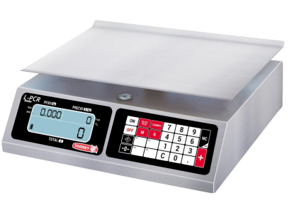

Series L-PCR
antes de operar su báscula, favor de leer ESTE MANUAL CUIDADOSAMENTE.

## Índice

2 3 5 5 6 7 8 9 9 9 10 11 11 11 12 12 12 13 13 13 14 14 14 15 16 17 18 Índice

Advertencias Importantes Introducción Instrucciones de instalación Nombre y localización de piezas Teclado Visor/Pantalla Descripción de las operaciones Cómo pesar un producto Como utilizar la tecla TARA
Cómo introducir precios Función PRECIO FIJO
Cómo usar la Referencia a CERO 
Suma de productos Visualizar total de la venta al momento Visualizar Venta Total Borrar Venta Total Grabar las memorias PLU`s Recordar una memoria Calcular Cambio Función de apagado automático Indicador de batería baja Uso de la batería Otros mensaje importantes de la bascula Mantenimiento y limpieza Guía para la localización de averías Especificaciones técnicas

La Batería Debe Ser Cargada Por 10 Hrs. Antes De Usar La Báscula Por Primera Vez.

## Cuidado

¡¡¡No abra la báscula!!! Precaución: para reducir el riesgo de corto Circuito en la báscula no abra ni sustituya Cualquiera de sus partes por otras que no sean autorizadas por el distribuidor.

2 Bascula electrónica

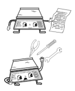

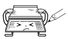

# Advertencias Importantes

1- En caso de tener problemas con la bascula, lea primero las condiciones de garantía.

2- No abra la bascula por su cuenta. La garantía quedaría anulada.

3- Nunca presione el teclado con objetos tales como lápices, plumas, navajas, etc.

4- Utilice una salida exclusiva para la bascula de

110-240VCA, evitando sobrecargas o variaciones de voltaje.

5- Nuca lave la bascula utilizando chorro de agua.

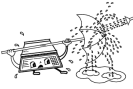

Podría dañar los componentes electrónicos. Para mas información lea la sección "mantenimiento y limpieza".

6- Proteja la bascula de los insectos (principalmente de las cucarachas), ya que pueden dañar los componentes electrónicos. Utilice productos solidos contra cucarachas.

7- No deje caer ni golpee la bascula con el producto a pesar, ya que con el paso del tiempo la celda de carga podría dañarse.

8- No utilice disolventes ni detergentes para la limpieza, utilice solamente un trapo húmedo.

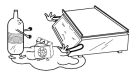

# Advertencias Importantes 

9- No dirija ventiladores ni calentadores directamente hacia la bascula.

10- No coloque la bascula donde haya un exceso de humedad o polvo.

11- Solamente personal autorizado y calificado deberá inspeccionar y reparar la bascula.

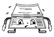

# Introducción

Estimado cliente: Le agradecemos su preferencia, nosotros le aseguramos que obtendrá la máxima satisfacción de su nueva adquisición para su negocio. Le sugerimos que lea el manual cuidadosamente, y asegúrese de tenerlo a la mano para próximas consultas.

## Instrucciones De Instalacion

1- Desempaque la báscula y compruebe que esté en buenas condiciones. Si encuentra algún desperfecto, notifíquelo inmediatamente a su distribuidor autorizado. 

2- Coloque la bascula en un lugar libre de movimientos y vibraciones, asegúrese de este bien nivelada, comprobando que los cuatro pies niveladores sostengan la bascula en la superficie en la que la ha colocado y que la burbuja de nivelación (debajo del plato) este centrada; ajuste, apriete o afloje los pies de nivelación hasta que la burbuja se sitúe en el centro del círculo.

3- Conecte el adaptador CA/CC (si lo utiliza) a una salida de 110VCA/240VCA.

4- Encienda la bascula y observara en el visor/pantalla:
NOTA IMPORTANTE: Si al efectuar los pasos descritos anteriormente la bascula muestra la palabra "HELP" significa que fue maltratada y/o golpeada durante el transporte, lo que le causó un daño irreversible. De ser así diríjase a su distribuidor autorizado también es posible que la báscula muestre "HELP" cuando se enciende con algún producto sobre el plato, en este caso, retire el peso de la bascula, apáguela y vuelva a encenderla.

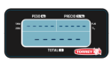

# Nombre Y Localización De Piezas

1.- GABINETE: Fabricado en acero inoxidable, resistente a la corrosión .

2.- PLATO: De grado alimenticio, fabricado acero inoxidable con las orillas dobladas y redondeadas.

3.- PORTAPLATO: Fabricado en aluminio, el cual posee resistencia a la corrosión.

4.- TECLADO CAPACITIVO: Con funciones y teclas legibles y operación al tocar.

5.- VISOR/PANTALLA: De cristal liquido. Indica peso, precio y total.

6.-PIES DE NIVELACION: Nivelan la bascula al ajustarlos.

7.-JACK: Conexión para el eliminador de batería a la bascula. Situada en la base de la bascula.

8.-VISOR/PANTALLA POSTERIOR. De cristal liquido. Indica peso, precio y total.

9.- NIVEL CIRCULAR: Se utiliza como referencia par nivelar la bascula. Situado en la parte superior del gabinete. 10.- ELIMINADOR DE BATERIAS: 120VCA/6VCC o 220VCA/6VCC (incluido).

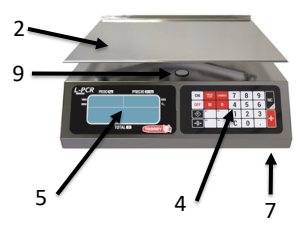

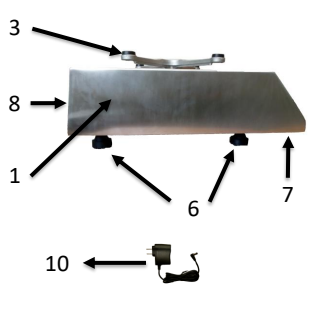

Bascula electrónica 6

# Teclado

1.- Enciende la bascula.

2.- Apaga la bascula.

12.- Teclas M1 a M4: Acceso directo a las memorias 01 a 04 (PLU).

Tecla NC (VT): Finaliza una venta e inicia a otra venta.

13.- Segunda función VT: Se activa después de mantener presionada por segundos. Muestra la Venta Total.

3.- Tecla CERO: Pone a cero el peso mostrado en la bascula.

 4.- Tecla TARA: Elimina el peso del recipiente sobre la bascula. 5.- Tecla M: Guarda precios en la memoria de la bascula (PLU). 6.- Tecla R: Recupera un precio almacenado en la memoria (PLU). 7.- SECCION NUMERICA: Introduce números a la bascula.

8.- Tecla "PUNTO": Introduce punto decimal.

9.- Tecla C: Borra datos erróneos introducidos desde el teclado.

10.- Tecla PRECIO FIJO: Activa la función de Precio Fijo. 11.- Tecla CAMBIO: Activa función para calcular el cambio. 14.- Tecla "+". Suma de artículos pesados.

# Visor/Pantalla

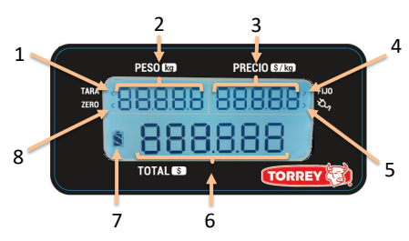

8.- Indicador de CERO: Se muestra cuando el peso sobre el plato es cero.
1.- Indicador de TARA: Se muestra cuando la función TARA es activada. 2.- Indicador de PESO: Muestra el peso del objeto sobre la bascula en kg.

3.- Indicador de PRECIO: Muestra el precio del producto por kg, hasta 5 dígitos.

4.- Indicador de PRECIO FIJO: Se muestra cuando la función PRECIO FIJO es activada.

5.- Indicador de ELIMINADOR CONECTADO: Aparece cuando el eliminador de baterías es conectado a la bascula y a su vez este esta conectado a un toma de corriente de 120/220VCA.

6.- Indicador de TOTAL: Muestra el total a pagar por el cliente (peso x precio).

7.- Indicador de CARGA DE BATERIA: Muestra el nivel de carga de la batería.

# Descripción De Operaciones Como Pesar Un Producto

Encienda la báscula presionando la tecla ON: Se mostrará en el

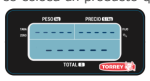 visor/pantalla " ------" por unos segundos, después el visor/pantalla mostrará ceros. En este momento la báscula esta lista para pesar. Luego coloque el producto a pesar en el plato y verá el peso en el indicador de PESO. El indicador de CERO desaparecerá del visor /pantalla. Por ejemplo: Si se coloca un producto que pesa 2.000 kg, el visor/pantalla mostrará:

## Como Utilizar La Tecla "Tara" 

Cuando desee pesar un producto en un recipiente y no desea considerar el peso de esté durante una operación de pesaje, puede utilizar la función TARA, para utilizar esta función solo debe colocar el envase o recipiente donde será contenido el material que desea pesar, después presione la tecla TARA e inmediatamente después en el visor /pantalla se activará el indicador de TARA y aparecerán ceros en la lectura del visor /pantalla. Ejemplo: Usted desea pesar 10 kg de algún producto líquido y el recipiente donde este líquido será contenido pesa 2,000kg. Coloque el recipiente sobre la báscula y esta le mostrará el peso del contenedor. Presione la tecla TARA, el visor/pantalla mostrará ceros y el indicador

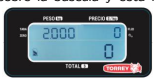

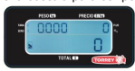 de TARA y CERO se activarán, ahora sí coloque el material dentro del contenedor puesto sobre la báscula para ser pesado. Si usted retira el recipiente contenedor de material mientras la

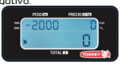 función TARA está activa, la báscula le mostrará el peso del recipiente con signo negativo.

Es importante mencionar que esta función es sustractiva, por ejemplo: Si tenemos un recipiente que pesa 2.000 kg la báscula solamente podrá pesar hasta 18.000 kg de producto para completar la capacidad máxima (20 kg) para cancelar la función de TARA solo presione la tecla "TARA" cuando se muestra el peso negativo del recipiente (al retirarlo de la bascula) y la báscula retornará a la función normal. El indicador de TARA desaparecerá. Las siguientes dos observaciones son de especial importancia:
a) Cuando no hay peso sobre la báscula (recipiente) no se puede activar la función de TARA. b) Cuando un recipiente es tarado y al momento de retirarlo se remueve un . . peso mayor al del recipiente (grasa o residuos de producto, etc.) o cuando el . plato es levantado un poco el visor/pantalla mostrara "------" (negativo) aparecerá.

Si esta situación llega a presentarse, siga estos pasos: a) Suelte el plato si lo está sosteniendo o levantando.

b) Si la báscula sigue marcando "------" (negativo), revise que no haya algún objeto levantando el porta plato.

c) Apague y prenda la báscula (reinicio).

## Como Introducir Precios 

El precio por kilogramo del producto se introduce presionando los números del teclado para indicar el valor deseado. Este valor aparecerá en el indicador de PRECIO y el valor a pagar se calculará automáticamente mostrándose en el indicador de TOTAL.

## Como Borrar Precios

Existen dos formas de hacerlo, estas son manual y automáticamente: Manual: Si por error Ud. llegase a marcar un precio equivocado y desea borrar ese precio simplemente oprima la tecla C y marque el nuevo precio. Automáticamente: después de quitar del plato el producto que se está pesando se borrará automáticamente el precio, excepto si se está trabajando con la función PRECIO FIJO.

10 Bascula electrónica

# Función Precio Fijo

Cuando usted requiere estar pesando constantemente el mismo tipo de producto, el cual no cambia de precio, puede utilizar la función PRECIO FIJO. Esta función sirve para mantener "fijo" el precio evitando que se borre automáticamente cuando se retira el producto de la báscula. Para fijar un precio siga estos pasos: 1) Coloque el producto sobre el plato.

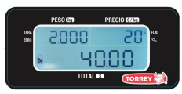 2) Tecleé el precio por kilogramo del producto o acceda a una memoria (PLU). 3) Oprima la tecla PRECIO FIJO, después de esto se mostrara el indicador PRECIO FIJO. Por ejemplo: Suponga que el producto es jamón cuyo peso es de 2.000 kg y el precio es de $20.00 el kilogramo. El visor quedará de la siguiente manera: 
Para quitar esta función oprima la tecla C.

## Como Usar La Referencia A Cero

Es posible que la báscula muestre números en el visor/pantalla sin tener algún producto en el plato, esto debido a variaciones de voltaje, manejo rudo, o algún otro factor. Cuando esto suceda solo presione la tecla CERO y el indicador de CERO se mostrara en el visor/pantalla, esta operación es conocida como "referenciar a cero".

## Suma De Productos

Coloque el peso sobre la báscula y teclee el precio del producto a vender, en automático la báscula le dará el total de la venta, presione la tecla "+" (MAS) para hacer la suma de productos, repita esta operación para obtener la cuenta total, para finalizar la venta, presione la tecla NC.

Total de Artículos Total de la Cuenta

# Visualizar Total De La Venta Al Momento 

Para ver el total de la suma de productos al momento ya no es necesario sumar otro articulo, solo es necesario retirar el peso que este sobre el plato y borrar el precio del indicador de PRECIO mediante la tecla C. Una ves que los tres indicadores (PESO, PRECIO y TOTAL) estén en ceros se presiona la tecla "+" (MAS) y se mostrara la suma total de artículos al momento.

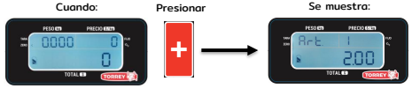

## Visualizar Venta Total

Para visualizar la Venta Total se utiliza la segunda función de la tecla NC, para activarla se presiona NC por 2 segundos.

## Borrar Venta Total

Para borrar la Venta Total (hacer 0 la Venta Total) es necesario primero desplegar Venta Total y una vez que se muestre el total presionar la secuencia de teclas NC, PUNTO (.).

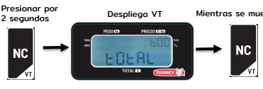

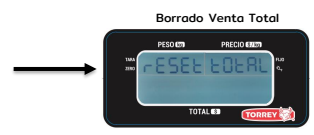

# Grabar Las Memorias Plu'S

Su báscula cuenta con 100 memorias para almacenar los precios de los 100 productos que se venden con más frecuencia, las memorias se enumeran de la 00 a la 99. Para grabar un número de memoria siga los siguientes pasos: 1) Escriba el precio que desea grabar. 2) Oprima la tecla "M"
3) Oprima el número de memoria donde desea grabar el precio (00-99).

Todas las posiciones de memoria son sobre escribibles. Las primeras 4 

 posiciones de memoria tienen las teclas de acceso rápido M1 a M4. 

## Recordar Una Memoria 

Oprima la tecla "R" y luego el número de memoria que desea recordar.

## Calcular Cambio

Para utilizar la función de cambio solamente presione la tecla CAMBIO. En el indicador de PESO se mostrara la palabra "PESOS", introduzca el monto del pago (presionando la tecla C se puede corregir esta cantidad) y vuelva a presionar la tecla CAMBIO. Se mostrara el monto de cambio CA (resta del monto introducido - total de suma de artículos).

# Función De Apagado Automático

Esta función esta activada permanentemente. Si la báscula está encendida sin que el eliminador/cargador se encuentre conectado a un toma corriente y la báscula no registra variaciones de peso en el plato o se presiona alguna tecla, por un período aproximado de 15 minutos, automáticamente se apagará para ahorrar la carga de su batería.

## Indicador De Batería Baja

Si la batería no tiene la suficiente energía para seguir operando por un largo tiempo. El indicador de batería baja se mostrará en el visor/pantalla. Esta es la primera señal que le indica que conecte el eliminador a una toma de corriente alterna.

## Uso De La Batería

La báscula puede operar con eliminador de baterías o con batería (4v incluida). la batería es recargable utilizando el eliminador de baterías y el procedimiento es el siguiente: Recarga: para realizar esta operación, solo conecte el eliminador de baterías a la báscula durante un tiempo de 10 horas aproximadamente con la báscula apagada. Si recarga la batería por algunas horas pero ésta no obtiene suficiente energía para encender la báscula, entonces se deberá de cambiar la batería por una nueva. En este caso contacte a su distribuidor autorizado. NOTA: ANTES DE OPERAR LA BÁSCULA SE DEBE RECARGAR LA . . . . BATERÍA DURANTE 10 HORAS. La capacidad de recarga de la batería decrece de acuerdo al número de ciclos de carga/descarga, esto ocasiona que la vida de la batería se reduzca a 1000 ciclos. Por esta razón la garantía de la batería es por seis meses después de la compra de su báscula. 

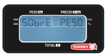

# Otros Mensajes Importantes Que Aparecen En La Báscula

## Sobre Peso

Este mensaje indica que el peso puesto en el plato de la báscula ha excedido la capacidad máxima soportable. Para corregir esto, simplemente retire el exceso de peso sobre la báscula.

## Pls Unload

Este mensaje aparece cuando la báscula es encendida con un peso excesivo sobre su plato (arriba del 20% de la capacidad de la báscula), para corregir esto retire el peso del plato, apague la báscula y vuelva a encenderla.

## Help

Este mensaje aparece en dos ocasiones diferentes: 1.- Cuando la báscula es encendida con un peso excesivo sobre su plato (arriba del 50% de la capacidad de la báscula), para corregir esto retire el peso del plato, apague la báscula y vuelva a encenderla.

## Exceso De Valor 

Este mensaje indica que el total esta excedido, cuando la multiplicación de precio por peso es mayor que 999999 se muestran guiones en el Indicador de TOTAL.

# Peso Negativo

Este mensaje indica que el peso es negativo,

 esto puede ser ocasionado si se levanta o se quita el plato de la báscula. Para corregir esto, verifique que no exista algo obstruyendo al porta plato y después presione la tecla CERO o apague la báscula y vuelva a encenderla.

## Mantenimiento Y Limpieza

Una de las grandes ventajas de adquirir este modelo de báscula es que requiere un mínimo de mantenimiento es muy simple para conservarla en un estado favorable. No debe usar agua a chorro o compresores para su limpieza, bastará con usar una franela húmeda para limpiar cada uno de los componentes. Para remover aceite y substancias grasosas utilice un trapo limpio y seco tallando el área sucia varias veces. No utilice detergentes ni líquidos corrosivos durante la limpieza. No coloque la báscula donde haya mucha humedad y/o polvo. Cuando limpie la báscula asegúrese que no haya papeles, piezas de carne o cualquier tipo de material debajo del plato o del porta plato que pudiera obstruir la adecuada operación de la báscula. Periódicamente revise el Jack donde se conecta el eliminador de las baterías para asegurar que se encuentre en buenas condiciones, esto con la finalidad de que no esté roto parcial o totalmente o el cable esté torcido. Verifique periódicamente que la báscula esté bien nivelada. No exponga la báscula a temperaturas por debajo de los -10°C (14°F) o superiores a los 40°C (104°F). Nunca presione el teclado con objetos tales como lápices, plumas, navajas o cualquier material punzocortante. No deje caer de golpe cualquier producto sobre el plato de la báscula ya que esto podría dañar la celda de carga.

# Guía Para La Localización De Averías

Antes de llamar a su distribuidor autorizado para solicitar el servicio técnico para su báscula, le sugerimos revise algunas de las posibles causas y soluciones para hacer que su báscula funcione correctamente.

| causas y soluciones para hacer que su báscula funcione correctamente. Problema Causa Solución La báscula no  enciende. Probablemente no  Conecte el cargador  tenga carga la batería. a una toma de  corriente alterna por 10 horas para cargar  la batería. La palabra "bAjA bAT" aparece en el  visor/pantalla. Conecte la báscula a  un enchufe del que  usted este seguro  que funciona  correctamente. La báscula no  enciende aún con el  eliminador conectado.  Un posible cable  roto en el  eliminador o un  enchufe defectuoso  De ser posible  verifique con un  multímetro el voltaje  que entrega el  eliminador ( 6 V). La báscula muestra   |                                                            |                                                                         |
|------------------------------------------------------------------------------------------------------------------------------------------------------------------------------------------------------------------------------------------------------------------------------------------------------------------------------------------------------------------------------------------------------------------------------------------------------------------------------------------------------------------------------------------------------------------------------------------------------------------------------------------------------------|------------------------------------------------------------|-------------------------------------------------------------------------|
| diferentes pesos cuando  se pesa un mismo  producto varias veces. Material debajo del porta plato está obstruyendo el correcto  funcionamiento.                                                                                                                                                                                                                                                                                                                                                                                                                                                                                                            |                                                            | Revise que no haya                                                      |
|                                                                                                                                                                                                                                                                                                                                                                                                                                                                                                                                                                                                                                                            |                                                            | ningún material debajo                                                  |
|                                                                                                                                                                                                                                                                                                                                                                                                                                                                                                                                                                                                                                                            |                                                            | del porta plato. Si existe,  remuévalo y revise la  operación de nuevo. |
| La palabra "HELP" aparece en el  visor/pantalla.                                                                                                                                                                                                                                                                                                                                                                                                                                                                                                                                                                                                           | La báscula fue prendida con un peso grande en el plato.    | Remueva el peso y  apague la báscula y  vuelva a encenderla.            |
|                                                                                                                                                                                                                                                                                                                                                                                                                                                                                                                                                                                                                                                            | La báscula fue prendida con un peso medio sobre  el plato. | Remueva el peso y  apague la báscula y  vuelva a encenderla.            |
| La palabra " PLS  UNLOAd" aparece en el  visor/pantalla.                                                                                                                                                                                                                                                                                                                                                                                                                                                                                                                                                                                                   |                                                            |                                                                         |

# Especificaciones Técnicas 

| MODELO L-PCR-20                                                     | MODELO L-PCR-40                                                     |
|---------------------------------------------------------------------|---------------------------------------------------------------------|
| MAX. 2/4/20kg MIN. 20g                                              |                                                                     |
| MIN. DIV. 1g, 2g, 5g MAX. TARA 9.995kg                              |                                                                     |
| PRECIO MAX/ kg $ 999.99 IMPORT MAX $9999.99 TEMP OPER -10°C a 40 °C | MAX. 4/8/40kg MIN. 40g                                              |
|                                                                     | MIN. DIV. 2g, 5g, 10g MAX. TARA 9.990kg                             |
|                                                                     | PRECIO MAX/ kg $ 999.99 IMPORT MAX $9999.99 TEMP OPER -10°C a 40 °C |

MAX = CAPACIDAD MAXIMA.

MIN. = CAPACIDAD MINIMA.

TARE MAX= TARA MAXIMA. PRICE MAX / kg = PRECIO MAXIMO POR kg IMPOR MAX = IMPORTE MAXIMO. TEMP OPER = TEMPERATURA DE OPERACION.

NOTA: LAS BATERÍAS SOLO PUEDEN 

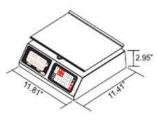 SER RECARGADAS DE 0ºC A 40ºC TEMPERATURA DE ALMACENAJE -4°F A 122°F O -20°C A 50°C. ENTRADA DEL ADAPTADOR/CARGADOR 120-240VCA 50/60HZ 0.2A SALIDA DEL ADAPTADOR CARGADOR 6VCC 0.5A

# Datos Adicionales

El número de serie de este producto puede ser encontrado en la placa de registro debajo de la bascula. Le sugerimos que escriba este número y el modelo correspondiente en los siguientes espacios y tenerlos como una prueba de su adquisición y para la ayuda de identificación en caso de pérdida o futuras consultas.

| Distribuidor___________________________________________ Dirección_____________________________________________ Teléfono______________________________________________   |    |
|-------------------------------------------------------------------------------------------------------------------------------------------------------------------------|----|
| Fecha de la compra____________________________________                                                                                                                  | _  |
| Modelo de la báscula___________________________________                                                                                                                 | _  |
| Número de serie_______________________________________                                                                                                                  | _  |

Nos reservamos el derecho de cambiar cualquier especificación contenida en este texto sin previo aviso. 

BÁSCULA

ELECTRÓNICA
www.torrey.net